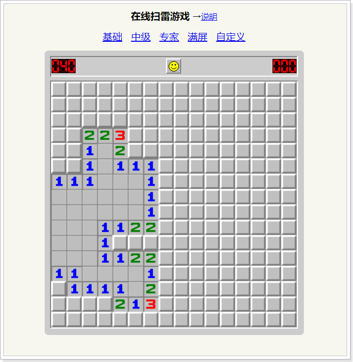
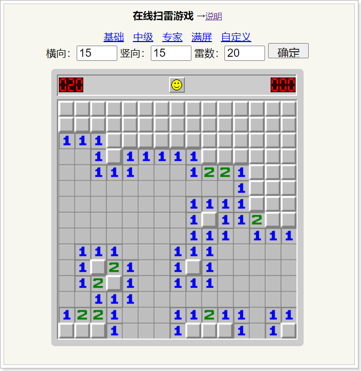
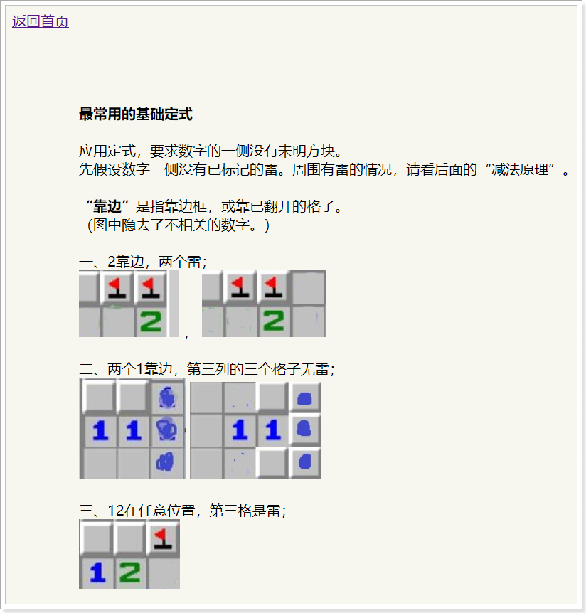

# 
扫雷 | Minesweeper

<head>
  <base target="_blank" />
</head>

	
		
	
	

## 简介说明：
* 没错！还是我~ 我就是大收藏家。“我不生产代码，我只是代码的搬运工”。
* 本仓库收录了一款经典游戏-------网页版在线**扫雷**。

## 在线预览
> 建议你使用Chrome浏览器访问~ GitHub在线预览，可能访问非常非常非常慢！！！=_=!
* [点击这里预览 **网页版扫雷**](https://local-host-8080.github.io/Minesweeper/index.html)（进入后选择对应难度可开始游戏）

> 预览图01：游戏主体 ↓↓↓

> 预览图02：自定义难度 ↓↓↓

> 预览图03：游戏教程 ↓↓↓

## 源码下载
* 如果你需要下载网页版扫雷源码，可以 **`Clone or download`** 整个项目到你的电脑。
* 小白直接点击这里下载整个项目源码--->[**下载**](https://github.com/local-host-8080/Minesweeper/archive/master.zip)

***

## 支持赞赏
* **GIVE A ⭐️ IF THIS PROJECT HELPED YOU!**

